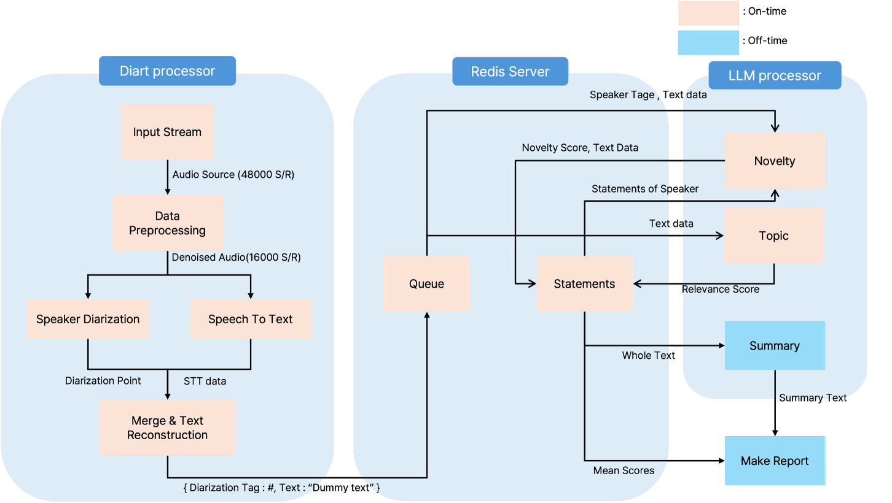

# Source Code

본 디렉토리는 AI 기반 실시간 회의 진행 효과성 평가 시스템(MeetingProgram)의 소스 코드를 포함합니다.

## 프로젝트 구조

```
Capstone2/
├── config/                          # 설정 파일
│   └── config_whisper.json         # Whisper 음성 인식 설정
├── doc/                            # 문서 및 다이어그램
│   ├── meeting_report_corrected.pdf
│   └── pipeline3.png
├── model/                          # 모델 학습 스크립트
│   ├── prepare_finetune_dataset.py # 학습 데이터 준비
│   └── train_gemma_lora.py         # Gemma LoRA 파인튜닝
├── output/                         # 생성된 결과물
│   └── reports/                    # PDF 보고서 저장 위치
├── test/                           # 테스트 코드
│   ├── config_whisper_guide.md
│   └── test_whisper2.py           # Whisper 테스트
├── src_F/                          # React 프론트엔드
│   ├── src/
│   │   ├── components/            # UI 컴포넌트
│   │   ├── services/              # WebSocket 서비스
│   │   ├── types.ts               # TypeScript 타입 정의
│   │   ├── App.tsx                # 메인 앱
│   │   ├── main.tsx
│   │   └── index.css
│   ├── build/                     # 빌드 결과물
│   ├── vite.config.ts
│   ├── package.json
│   └── package-lock.json
├── whisper_web_ui.py               # FastAPI 백엔드 메인 파일
├── pyproject.toml                  # Python 의존성
├── uv.lock
└── README.md                       # 실행 가이드
```

## 주요 파일 설명

### 백엔드 (Python)

- **whisper_web_ui.py** (1,880줄): 메인 FastAPI 서버
  - WebSocket 연결 관리 (`ConnectionManager`)
  - 실시간 음성 전사 서비스 (`TranscriptionService`)
  - 화자 인식 및 관리 (`SpeakerHandler`, `SpeechBrainEncoder`)
  - 음성 활동 감지 (`SileroVAD`)
  - AI 기반 발언 평가 (`OllamaEvaluator`)
  - 회의 통계 관리 (`MeetingStatistics`)
  - 보고서 생성 (ReportLab)
  - REST API 엔드포인트 및 WebSocket 핸들러

- **model/train_gemma_lora.py**: Gemma 3 270M 모델 LoRA 파인튜닝
  - 4-bit 양자화 옵션 (QLoRA)
  - LoRA 어댑터 학습 (r=16, alpha=32)
  - SFT(Supervised Fine-Tuning) 기반

- **model/prepare_finetune_dataset.py**: 평가 결과를 학습 데이터셋으로 변환

- **test/test_whisper2.py**: Whisper 음성 인식 테스트 스크립트

### 프론트엔드 (React/TypeScript)

- **src_F/src/App.tsx**: 메인 React 컴포넌트
  - WebSocket 연결 및 상태 관리
  - 실시간 데이터 핸들링
  - 하위 컴포넌트 조율

- **src_F/src/components/**: UI 컴포넌트
  - `RealtimeSpeech.tsx`: 음성 입력 제어
  - `Statistics.tsx`: 전체 통계 및 차트
  - `SpeakerAnalysisTable.tsx`: 화자별 분석 테이블
  - `TimelineVisualization.tsx`: 회의 타임라인
  - `AudioVisualizer.tsx`: 오디오 웨이브폼
  - `ui/`: Radix UI 기반 50+ 기본 컴포넌트

- **src_F/src/services/websocket.ts**: WebSocket 연결 관리 및 자동 재연결

- **src_F/src/types.ts**: TypeScript 타입 정의

### 설정 파일

- **config/config_whisper.json**: Whisper 모델 및 음성 처리 설정
  - 모델 ID, 언어, 샘플링 레이트
  - 청크 길이, 배치 크기
  - 생성 파라미터 (temperature, threshold 등)

## 시스템 아키텍처



## 음성 처리 파이프라인

```
마이크 입력 (48kHz)
    ↓
[SoundDevice] 실시간 캡처
    ↓
[Resampler] 48kHz → 16kHz
    ↓
[Silero VAD] 음성/침묵 판별
    ↓
[SpeechBrain] 화자 임베딩 추출
    ↓
[Whisper] 한국어 음성 인식
    ↓
[Ollama Gemma] 발언 평가
    ↓
[WebSocket] 클라이언트 전송
```

## 실행 방법

### 사전 요구사항

- Python 3.12+
- Node.js 18+
- 4GB+ VRAM (CPU 사용 가능)
- Ollama 설치 및 실행

### 1. Ollama 모델 다운로드 및 실행

```bash
# Gemma 모델 다운로드
ollama pull gemma3-270m-local-e3

# Ollama 서버 시작 (별도 터미널)
ollama serve
```

### 2. Python 백엔드 실행

```bash
# Capstone2 디렉토리로 이동
cd "002 Code/Capstone2"

# 의존성 설치 (pyproject.toml 참조)
pip install -e .

# 백엔드 서버 시작
python whisper_web_ui.py
```

### 3. 프론트엔드 빌드 및 실행

```bash
# 프론트엔드 디렉토리로 이동
cd src_F

# 의존성 설치
npm install

# 빌드
npm run build

# 개발 서버 시작
npm run dev
```

### 4. 접속

- 웹 UI: http://localhost:3000
- API 서버: http://localhost:8000
- WebSocket: ws://localhost:8000/ws

## API 엔드포인트

| 메서드 | 경로 | 기능 |
|--------|------|------|
| GET | `/` | 대시보드 HTML |
| GET | `/health` | 서버 상태 확인 |
| GET | `/api/status` | 회의 상태 조회 |
| GET | `/api/speakers` | 화자 목록 및 통계 |
| GET | `/api/timeline` | 회의 타임라인 |
| GET | `/api/report` | PDF/JSON 보고서 다운로드 |
| POST | `/api/start` | 회의 시작 |
| POST | `/api/stop/{session_id}` | 회의 종료 |
| WS | `/ws` | 실시간 메시지 스트림 |

## WebSocket 메시지 타입

- `transcription`: 음성 전사 결과
- `evaluation`: AI 발언 평가 결과
- `stats_update`: 통계 업데이트
- `session_status`: 세션 상태 변경
- `report_ready`: 보고서 생성 완료

## 모델 파인튜닝

### 데이터셋 준비

```bash
python model/prepare_finetune_dataset.py
```

### Gemma LoRA 학습

```bash
python model/train_gemma_lora.py
```

학습 옵션:
- 4-bit 양자화 (QLoRA)
- LoRA rank: 16, alpha: 32
- Learning rate: 2e-4
- Epochs: 3

## 사용된 오픈소스 라이브러리

### AI 모델

| 프로젝트 | 용도 | 라이선스 |
|----------|------|---------|
| OpenAI Whisper | 음성 인식 | MIT |
| Silero VAD | 음성 감지 | MIT |
| SpeechBrain | 화자 임베딩 | Apache 2.0 |
| Google Gemma | LLM 평가 | Gemma Terms |
| Ollama | 로컬 LLM 서빙 | MIT |

### 백엔드

| 프로젝트 | 용도 | 라이선스 |
|----------|------|---------|
| FastAPI | 웹 서버 | MIT |
| PyTorch | 딥러닝 | BSD |
| Transformers | 모델 로딩 | Apache 2.0 |
| ReportLab | PDF 생성 | BSD |
| SoundDevice | 오디오 입력 | MIT |

### 프론트엔드

| 프로젝트 | 용도 | 라이선스 |
|----------|------|---------|
| React | UI 라이브러리 | MIT |
| Vite | 빌드 도구 | MIT |
| Radix UI | UI 컴포넌트 | MIT |
| Recharts | 차트 | MIT |
| Tailwind CSS | 스타일링 | MIT |

## 라이선스

HBNU License

# 주의사항
- ### 다른 Open Source SW를 사용하는 경우 저작권을 명시해야 함
- ### 특정 기업의 기밀 정보 또는 개인 정보 등의 데이터는 제외할 것
  #### ※  특정 기업의 기밀 정보 또는 개인 정보 등의 데이터가 Github에 공개되었을 시의 책임은 공개한 학생에게 있음 
